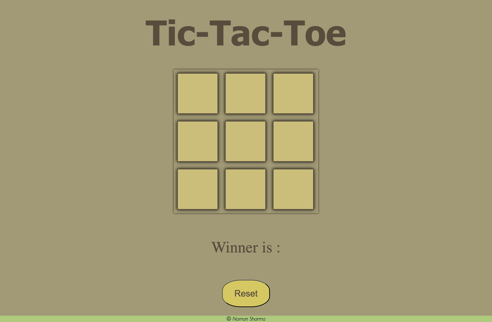

<body style="font-family: Arial, sans-serif; margin: 20px; line-height: 1.6; color: #333; background-color: #f4f4f4;">
    <h1 style="text-align: center; color: #2c3e50;">Tic-Tac-Toe Game</h1>
    
    

        This Tic-Tac-Toe game is a simple yet engaging project built using HTML, CSS, and JavaScript. Its primary goal is to enhance your understanding of JavaScript and improve your familiarity with web development concepts.
    

    

        The game features an interactive user interface created with HTML, styled beautifully using CSS, and powered by JavaScript to handle the game logic, player interactions, and win condition checks.
    

    

        By working on this project, you'll gain practical experience in DOM manipulation, event handling, and basic game design principles, making it a valuable learning tool for aspiring web developers.
    

    

        Whether you’re looking to sharpen your coding skills or explore the fundamentals of web development, this game serves as an excellent starting point!
    

</body>
